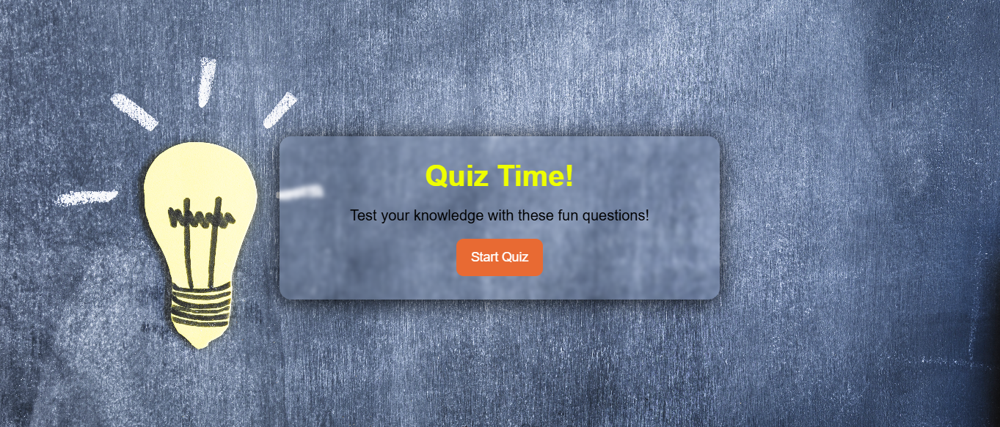

# 🧠 Quiz App


An interactive and visually engaging **Quiz App** built using **HTML, CSS, and JavaScript**.  
Test your knowledge with fun multiple-choice questions and get your score instantly!

---

## 🚀 Features

- 📋 Multiple-choice quiz interface
- ✅ Real-time score calculation
- 💡 Visual feedback for right/wrong answers
- 🎨 Beautiful background and transitions
- 📱 Fully responsive for mobile and desktop

---

## 🛠️ Tech Stack

- HTML5
- CSS3
- JavaScript (Vanilla)

---

## 📸 Screenshots

> Store these screenshots in your `assets/` folder and update filenames accordingly:

| Start Screen | Quiz Screen | Result Screen |
|--------------|-------------|---------------|
|  |  |  |

---

## 📁 Project Structure
quiz-app/
│
├── index.html              # Main HTML structure
├── style.css               # CSS styling
├── script.js               # JavaScript logic
├── assets/                 # Images and screenshots
│   ├── homescreen.png
│   ├── startscreen.png
│   └── resultscreen.png
├── README.md               # Project documentation
└── .gitignore              # Git ignore rules


## 💻 Run Locally

Clone this repository and open the app in your browser:

```bash
git clone https://github.com/G-Sabari/quiz-app.git
cd quiz-app
# Then open index.html in your browser
